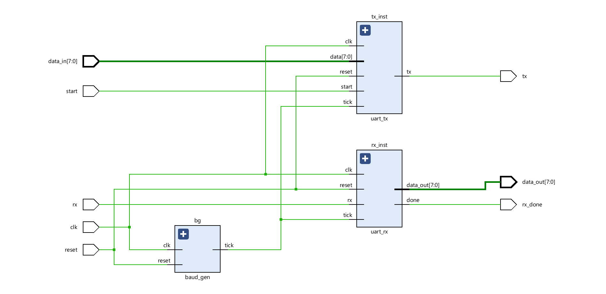
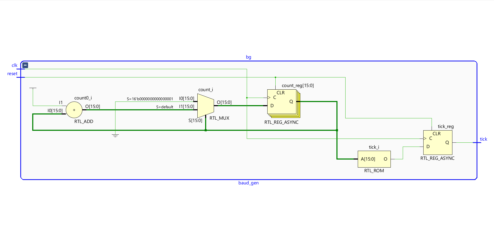
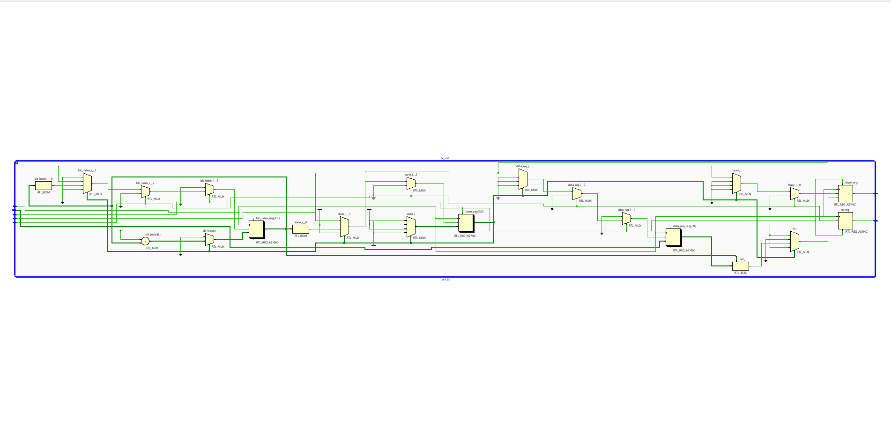
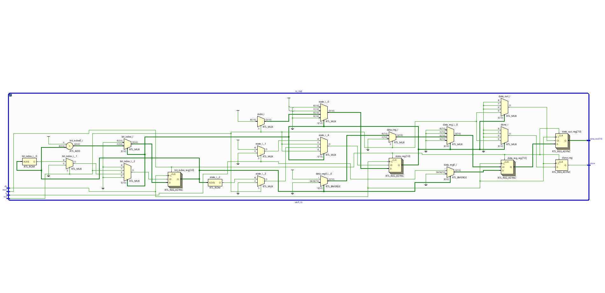
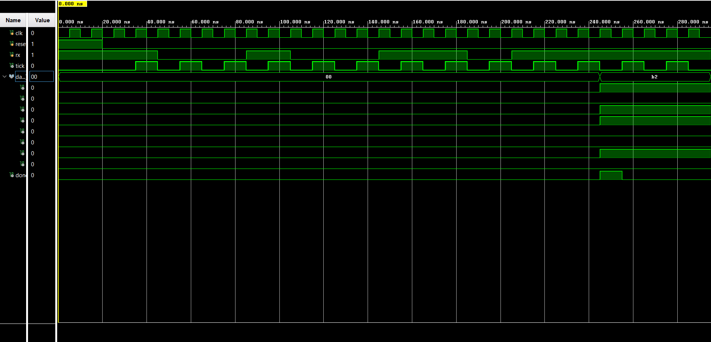

# UART RTL Design (Verilog)

## 📌 Overview

This project implements a **UART (Universal Asynchronous Receiver Transmitter)** at RTL level using Verilog.
It includes both **transmitter (TX)** and **receiver (RX)** modules along with a **baud rate generator**.

---

## ⚙️ Features

* 8-bit data transmission
* Start and stop bit handling
* Separate TX and RX modules
* Baud rate generation using clock division
* Fully verified using testbenches

---

## 🧱 Architecture

### 🔹 Top-Level Block Diagram



---

### 🔹 Baud Rate Generator



* Generates tick signal for timing
* Based on counter and clock division

---

### 🔹 UART Transmitter (TX)



* Uses shift register
* Sends start bit, data bits, stop bit

---

### 🔹 UART Receiver (RX)



* Detects start bit
* Samples incoming bits
* Outputs received data

---

## 🧪 Simulation Results



* Correct start bit detection
* Proper bit timing using tick
* Data successfully transmitted and received

---

## 📂 Project Structure

```
uart-rtl-design/
├── src/          # RTL modules
├── tb/           # Testbenches
├── images/       # Diagrams & waveforms
└── README.md
```

---

## 🛠 Tools Used

* Verilog HDL
* Xilinx Vivado
* XSIM Simulator

---

## 🚀 Future Improvements

* Add parity bit support
* Configurable baud rate
* FIFO buffering
* FPGA hardware implementation

---

## 💡 Key Learning

* RTL design methodology
* FSM-based serial communication
* Timing control using baud generator
* Modular hardware design
